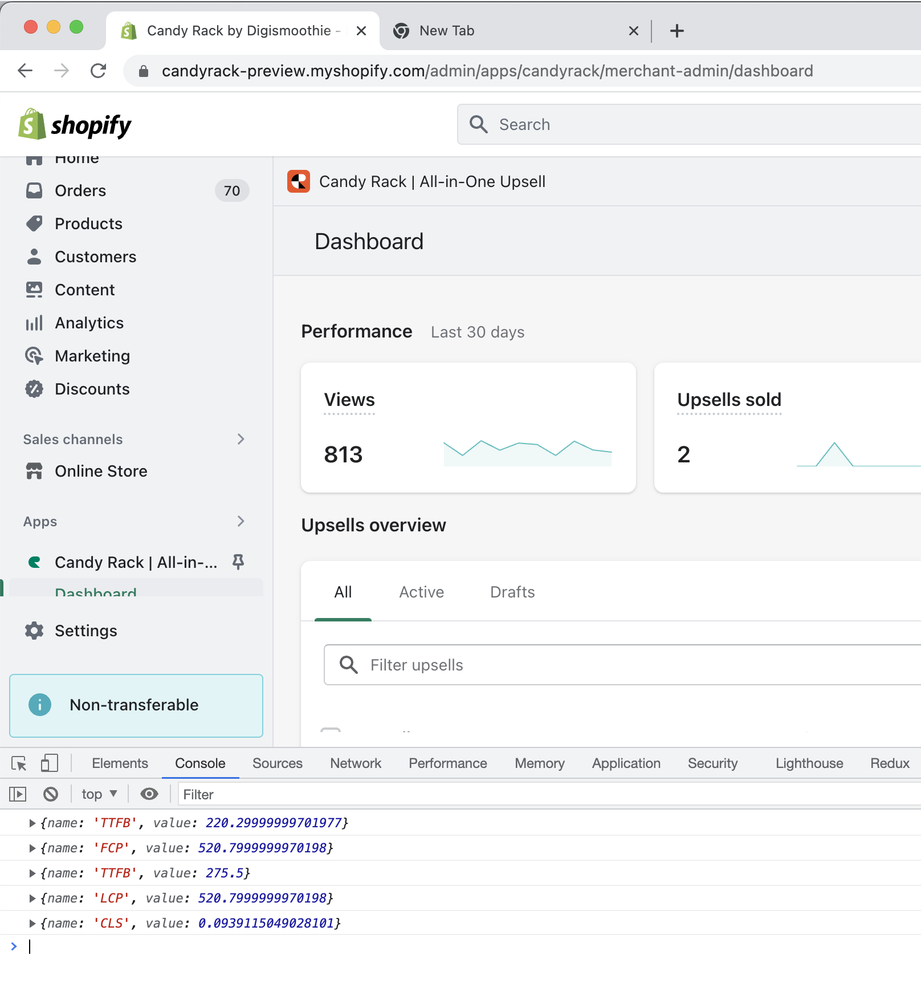

# Shopify Admin App Web Vitals Logger

This Chrome extension enables you to read and log the Web Vitals data gathered by the Shopify App Bridge. It helps in debugging performance issues and aids in optimizing Shopify apps for the best user experience.

## Features

- Automatic retrieval of Web Vitals data from Shopify App Bridge.
- Real-time logging of performance data to the console.

## How to Install

This guide explains how to install the extension in your browser in development mode.

1. Clone or download this repository.

2. Navigate to `chrome://extensions/` in your Chrome browser.

3. Switch on the `Developer mode` toggle in the top right corner.

4. Click on the `Load unpacked` button.

5. Browse to the directory where you cloned the repository and select the `shopify-admin-web-vitals-logger` folder.

6. Confirm and the extension should now appear in your extensions list, ready for use.

## How to Use

1. Open your Shopify admin page.

2. Open the browser console (You can do this by right-clicking anywhere on the page, select "Inspect", then click on "Console").

3. You will see the Web Vitals logs in the console.

**Note:** Make sure the Shopify App Bridge is correctly installed and configured in your Shopify app, as this extension relies on the data provided by it.

## License

This project is licensed under the MIT License - see the [LICENSE](LICENSE) file for details.